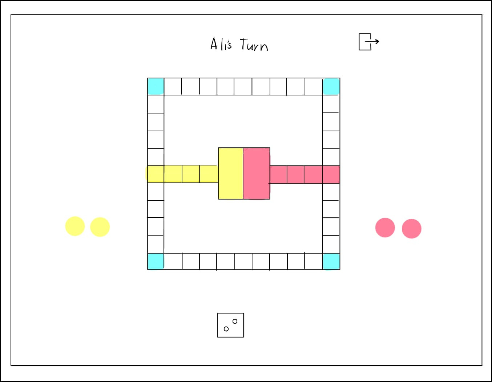

# Ludo-game
## By: Zainab Aljad
### Date: 5th-Feb-2026

#### [Website](#) | [GitHub](https://github.com/Zaljad) | [LinkedIn](linkedin.com/in/zainab-aljad-004016375)
***

### ***Description***
#### Mini Ludo is a simplified version of the classic Ludo game for two players. Each player must roll a 6 to enter their tokens onto the board and move them along the path. Players try to reach their tokens finish zone first, while avoiding being sent back by the opponent. Safe cells protect tokens from being captured. The first player to get all their tokens to the finish zone wins.
***

### ***Technologies Used***
* HTML
* CSS
* JavaScript
***

### ***Getting Started***

##### The project was deployed and can be viewed [here](URL).
***
### Game Wireframes:

##### image header 1

##### image header 1

***
### ***Screenshots***

##### image header 1

##### image header 2

***

### ***Future Updates***

- [ ] Make it fo 4 players
- [ ] Add more dice
***

### ***Credits***

##### : [#](#)

##### : [#](#)

##### Markdown Cheatsheet: [GitHub](#)
***

